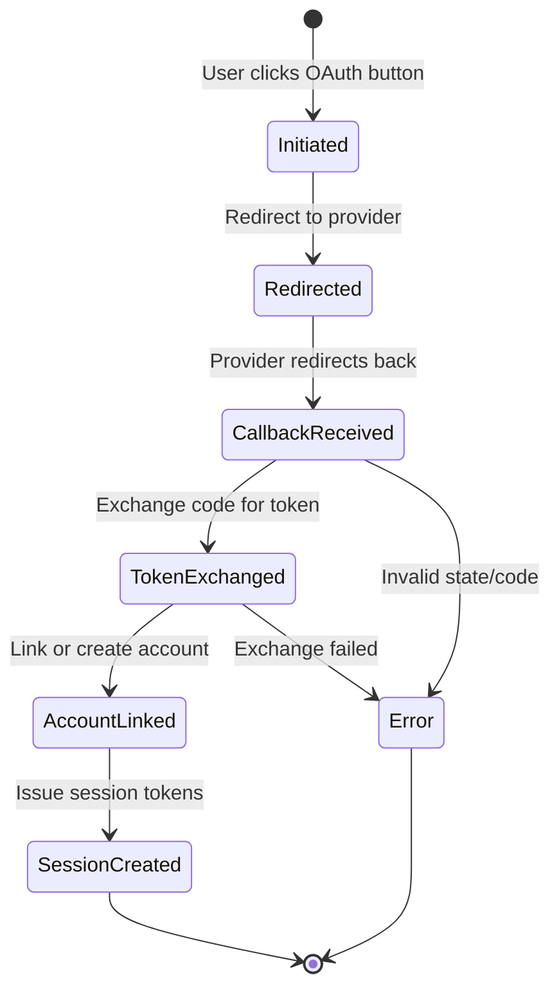

# Implementation Plan

## Phase 1: Core Authentication (Week 1-2)

### Database Setup

Create the user and session tables with proper indexes:

```sql
CREATE TABLE users (
    id UUID PRIMARY KEY DEFAULT gen_random_uuid(),
    email VARCHAR(255) UNIQUE NOT NULL,
    password_hash VARCHAR(72),
    display_name VARCHAR(100) NOT NULL,
    email_verified BOOLEAN DEFAULT false,
    created_at TIMESTAMP NOT NULL DEFAULT now(),
    updated_at TIMESTAMP NOT NULL DEFAULT now(),
    last_login_at TIMESTAMP
);

CREATE INDEX idx_users_email ON users (email);
CREATE INDEX idx_users_created_at ON users (created_at);
```

### Auth Service Implementation

1. Set up the Go service with Gorilla Mux router
2. Implement password hashing with bcrypt (cost factor 12)
3. Build JWT token generation (RS256) and validation
4. Set up Redis connection for refresh token storage

### Endpoints to Implement

- [x] `POST /auth/register` - User registration
- [x] `POST /auth/login` - Email/password login
- [x] `POST /auth/refresh` - Token refresh with rotation
- [ ] `POST /auth/logout` - Session invalidation
- [ ] `POST /auth/verify` - Email verification

## Phase 2: OAuth Integration (Week 3)

### Provider Setup

- [ ] Register OAuth apps with Google and GitHub
- [ ] Implement authorization code flow
- [ ] Build account linking logic (match by verified email)
- [ ] Handle edge cases (revoked access, expired tokens)

### State Management



## Phase 3: RBAC (Week 4)

### Default Roles

| Role | Permissions | Description |
|------|-------------|-------------|
| `viewer` | `read:*` | Read-only access |
| `editor` | `read:*`, `write:*` | Read and write access |
| `admin` | `read:*`, `write:*`, `manage:users`, `manage:roles` | Full access |
| `owner` | `*` | Superuser access |

### Middleware Implementation

- [ ] Build RBAC middleware for Gorilla Mux
- [ ] Implement permission checking from JWT claims
- [ ] Add role hierarchy support
- [ ] Create admin API for role management

## Verification Plan

### Unit Tests

- Password hashing and verification
- JWT generation and validation
- Refresh token rotation logic
- RBAC permission evaluation

### Integration Tests

- Full registration → verification → login flow
- OAuth flow with mocked providers
- Token refresh with concurrent requests
- Rate limiting enforcement

### Security Testing

- SQL injection on login/register endpoints
- JWT tampering and signature verification
- Refresh token reuse detection
- Brute force protection validation
