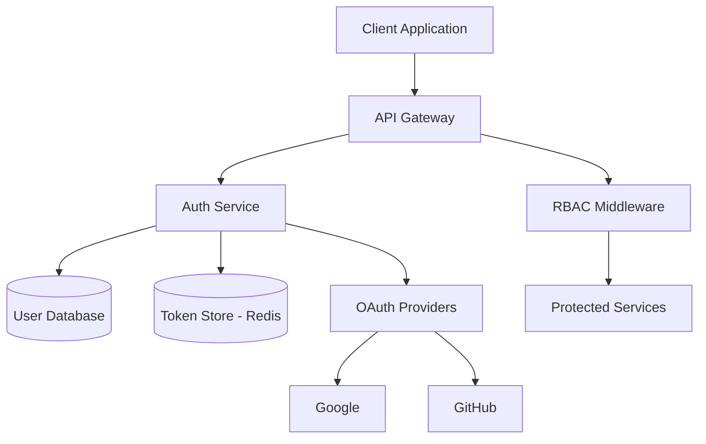
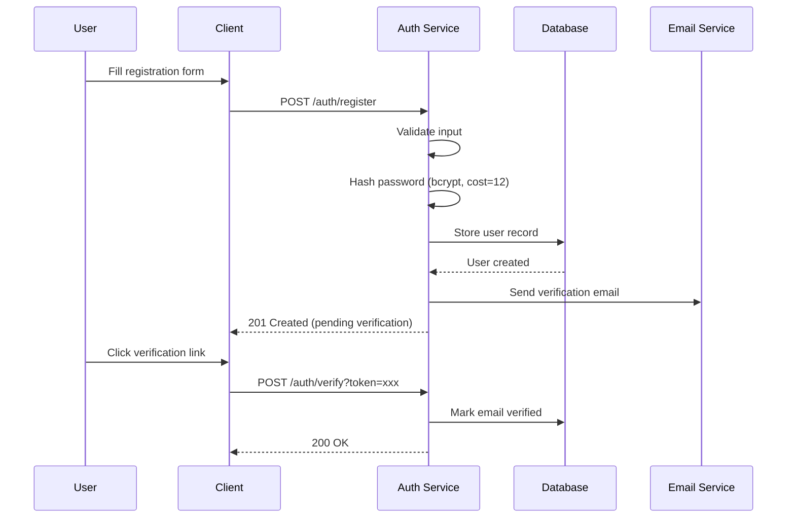
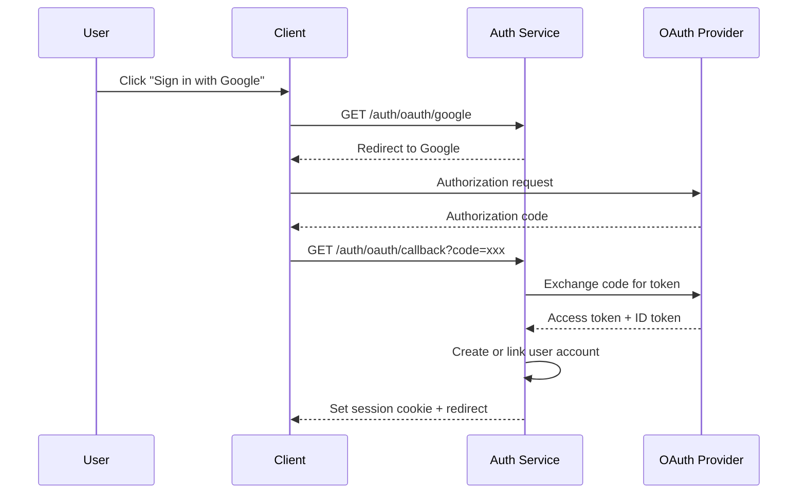
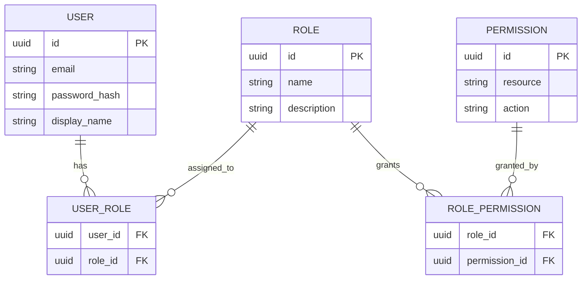

# User Authentication System

## Overview

This specification defines the authentication and authorization system for the platform. It covers user registration, login flows, session management, and role-based access control (RBAC).

## Goals

- Provide secure, standards-compliant authentication
- Support multiple identity providers (email/password, OAuth 2.0)
- Implement role-based access control with granular permissions
- Maintain session security with token rotation

## Architecture



## Authentication Flows

### Email/Password Registration



### OAuth 2.0 Flow



## Data Model

### User Entity

| Field | Type | Constraints | Description |
|-------|------|-------------|-------------|
| `id` | UUID | PK | Unique identifier |
| `email` | VARCHAR(255) | UNIQUE, NOT NULL | User email address |
| `password_hash` | VARCHAR(72) | NULL (OAuth users) | Bcrypt hash |
| `display_name` | VARCHAR(100) | NOT NULL | Display name |
| `email_verified` | BOOLEAN | DEFAULT false | Verification status |
| `created_at` | TIMESTAMP | NOT NULL | Account creation time |
| `updated_at` | TIMESTAMP | NOT NULL | Last update time |
| `last_login_at` | TIMESTAMP | NULL | Last login time |

### Role & Permission Model



## API Endpoints

### `POST /auth/register`

Register a new user with email and password.

**Request Body:**

```json
{
  "email": "user@example.com",
  "password": "securePassword123!",
  "display_name": "Jane Doe"
}
```

**Validation Rules:**
- `email`: valid email format, max 255 chars
- `password`: min 8 chars, at least 1 uppercase, 1 lowercase, 1 digit, 1 special char
- `display_name`: 2-100 chars, no leading/trailing whitespace

**Response (201):**

```json
{
  "id": "550e8400-e29b-41d4-a716-446655440000",
  "email": "user@example.com",
  "display_name": "Jane Doe",
  "email_verified": false,
  "created_at": "2025-01-15T10:30:00Z"
}
```

### `POST /auth/login`

Authenticate a user and create a session.

**Request Body:**

```json
{
  "email": "user@example.com",
  "password": "securePassword123!"
}
```

**Response (200):**

```json
{
  "access_token": "eyJhbGciOiJSUzI1NiIs...",
  "refresh_token": "dGhpcyBpcyBhIHJlZnJl...",
  "token_type": "Bearer",
  "expires_in": 900
}
```

**Error Responses:**

| Status | Code | Description |
|--------|------|-------------|
| 400 | `INVALID_INPUT` | Missing or malformed fields |
| 401 | `INVALID_CREDENTIALS` | Wrong email or password |
| 403 | `EMAIL_NOT_VERIFIED` | Email pending verification |
| 429 | `RATE_LIMITED` | Too many login attempts |

## Token Strategy

### Access Tokens

- **Format:** JWT (RS256)
- **Lifetime:** 15 minutes
- **Contains:** `sub`, `email`, `roles`, `permissions`, `iat`, `exp`
- **Storage:** Memory only (never persisted client-side)

### Refresh Tokens

- **Format:** Opaque, cryptographically random (256-bit)
- **Lifetime:** 7 days (sliding window)
- **Storage:** HttpOnly, Secure, SameSite=Strict cookie
- **Rotation:** New refresh token issued on each use; old token invalidated

### Token Refresh Flow

```go
func (s *AuthService) RefreshToken(ctx context.Context, refreshToken string) (*TokenPair, error) {
    // Validate refresh token exists and is not expired
    session, err := s.tokenStore.Get(ctx, refreshToken)
    if err != nil {
        return nil, ErrInvalidRefreshToken
    }

    // Invalidate the old refresh token (rotation)
    if err := s.tokenStore.Delete(ctx, refreshToken); err != nil {
        return nil, fmt.Errorf("failed to rotate token: %w", err)
    }

    // Generate new token pair
    accessToken, err := s.generateAccessToken(session.UserID, session.Roles)
    if err != nil {
        return nil, fmt.Errorf("failed to generate access token: %w", err)
    }

    newRefreshToken, err := s.generateRefreshToken()
    if err != nil {
        return nil, fmt.Errorf("failed to generate refresh token: %w", err)
    }

    // Store new refresh token
    if err := s.tokenStore.Set(ctx, newRefreshToken, session, 7*24*time.Hour); err != nil {
        return nil, fmt.Errorf("failed to store refresh token: %w", err)
    }

    return &TokenPair{
        AccessToken:  accessToken,
        RefreshToken: newRefreshToken,
        ExpiresIn:    900,
    }, nil
}
```

## Security Requirements

### Password Policy

1. Minimum 8 characters
2. Must contain: uppercase, lowercase, digit, special character
3. Cannot match the user's email or display name
4. Checked against the [Have I Been Pwned](https://haveibeenpwned.com/API/v3) breached passwords API

### Rate Limiting

| Endpoint | Window | Max Requests |
|----------|--------|--------------|
| `POST /auth/login` | 15 min | 5 per email |
| `POST /auth/register` | 1 hour | 3 per IP |
| `POST /auth/forgot-password` | 1 hour | 3 per email |
| `POST /auth/verify` | 15 min | 10 per IP |

### Session Security

- Tokens stored in Redis with TTL
- Refresh token rotation on every use
- All sessions invalidated on password change
- Concurrent session limit: 5 per user

## Non-Functional Requirements

- **Latency:** Login < 200ms p95
- **Availability:** 99.9% uptime
- **Scalability:** Support 10,000 concurrent sessions
- **Compliance:** GDPR (right to deletion), SOC 2 Type II
