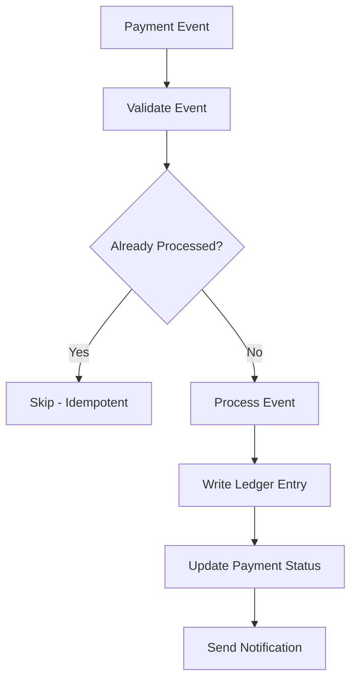

# Implementation Plan

## Phase 1: Payment Foundation (Week 1-2)

### Stripe Integration

1. Set up Stripe SDK and API keys management
2. Implement PaymentIntent creation and confirmation
3. Build webhook endpoint with signature verification
4. Set up event processing queue (Redis)

### Database & Ledger

- [ ] Create payments table with proper indexes
- [ ] Create ledger_entries table (append-only)
- [ ] Create webhook_events table (idempotency)
- [ ] Implement ledger service with transaction support

### Endpoints

- [ ] `POST /payments` - Create payment intent
- [ ] `GET /payments/:id` - Get payment with ledger
- [ ] `POST /payments/:id/refund` - Issue refund
- [ ] `POST /webhooks/stripe` - Webhook receiver

## Phase 2: Reliability (Week 3)

### Event Processing

- [ ] Implement exponential backoff retry
- [ ] Set up dead letter queue
- [ ] Build webhook event replay tool
- [ ] Add idempotency key support for API requests

### Monitoring

- [ ] Payment success/failure rate dashboards
- [ ] Webhook processing latency alerts
- [ ] Dead letter queue depth alerts
- [ ] Daily reconciliation job

## Phase 3: Enterprise Features (Week 4)

- [ ] Invoice generation for enterprise customers
- [ ] Multi-currency support
- [ ] Subscription billing with Stripe Billing
- [ ] Revenue reporting and analytics

## Verification Plan

### Unit Tests

- Ledger entry calculation and balance tracking
- Currency conversion and rounding
- Idempotency key deduplication
- Refund amount validation

### Integration Tests

- Full payment flow with Stripe test mode
- Webhook event processing end-to-end
- Concurrent payment creation with same idempotency key
- Refund exceeding available amount

### Load Tests

- 1000 concurrent payment intents
- Webhook burst processing (100 events/second)
- Database connection pool under load
