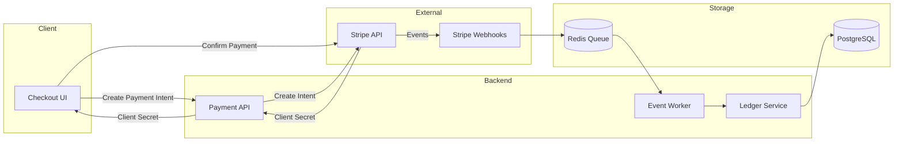
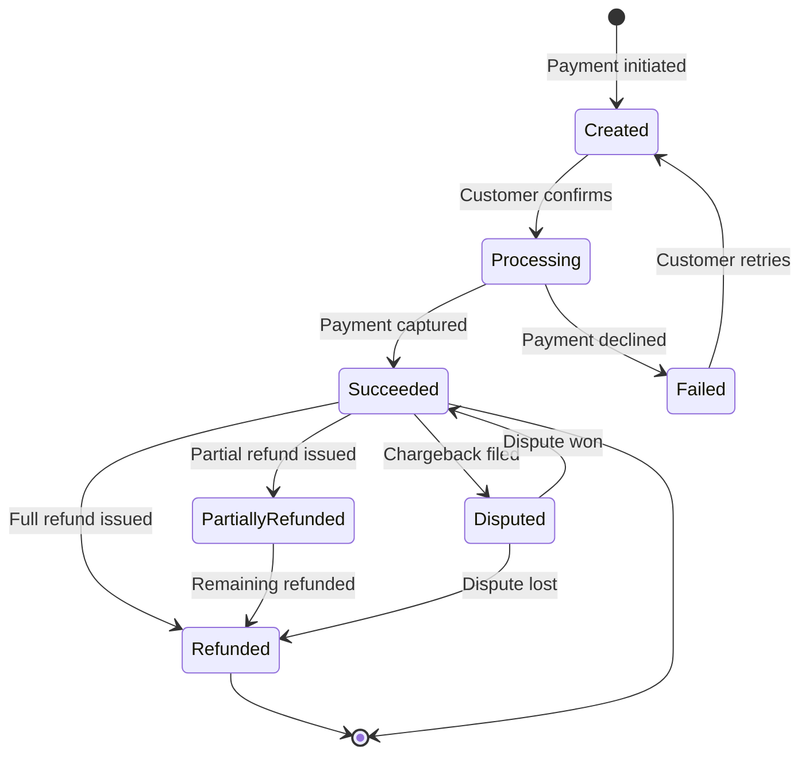

# Payment Processing System

## Overview

This specification defines the payment processing pipeline for handling customer transactions. It supports credit card payments via Stripe, invoicing for enterprise customers, and webhook-driven event processing for payment lifecycle management.

## System Architecture



## Payment Lifecycle



## Data Model

### Payment Entity

| Field | Type | Description |
|-------|------|-------------|
| `id` | UUID | Internal payment ID |
| `stripe_payment_intent_id` | VARCHAR | Stripe PaymentIntent ID |
| `customer_id` | UUID | FK to customers table |
| `amount` | BIGINT | Amount in smallest currency unit (cents) |
| `currency` | VARCHAR(3) | ISO 4217 currency code |
| `status` | ENUM | `created`, `processing`, `succeeded`, `failed`, `refunded`, `disputed` |
| `description` | TEXT | Payment description |
| `metadata` | JSONB | Arbitrary key-value metadata |
| `created_at` | TIMESTAMP | Creation time |
| `updated_at` | TIMESTAMP | Last status change |

### Ledger Entry

Every financial event produces an immutable ledger entry:

| Field | Type | Description |
|-------|------|-------------|
| `id` | UUID | Ledger entry ID |
| `payment_id` | UUID | FK to payments |
| `type` | ENUM | `charge`, `refund`, `dispute`, `adjustment` |
| `amount` | BIGINT | Signed amount (negative for refunds) |
| `balance_after` | BIGINT | Running balance after this entry |
| `created_at` | TIMESTAMP | Entry creation time |

## API Endpoints

### `POST /payments`

Create a new payment intent.

**Request:**

```json
{
  "amount": 4999,
  "currency": "usd",
  "customer_id": "cust_abc123",
  "description": "Pro plan - monthly subscription",
  "metadata": {
    "plan": "pro",
    "billing_period": "2025-02"
  }
}
```

**Response (201):**

```json
{
  "id": "pay_550e8400",
  "client_secret": "pi_abc123_secret_xyz",
  "amount": 4999,
  "currency": "usd",
  "status": "created",
  "created_at": "2025-02-01T00:00:00Z"
}
```

### `POST /payments/:id/refund`

Issue a full or partial refund.

**Request:**

```json
{
  "amount": 2500,
  "reason": "customer_request"
}
```

> **Note:** Omit `amount` for a full refund. Partial refunds must not exceed the original payment amount minus any previous refunds.

### `GET /payments/:id`

Retrieve payment details including ledger history.

**Response (200):**

```json
{
  "id": "pay_550e8400",
  "amount": 4999,
  "currency": "usd",
  "status": "succeeded",
  "ledger": [
    {
      "type": "charge",
      "amount": 4999,
      "balance_after": 4999,
      "created_at": "2025-02-01T00:01:00Z"
    }
  ]
}
```

## Webhook Processing

### Event Handling Strategy

Stripe sends webhook events that must be processed idempotently:

```go
func (h *WebhookHandler) HandleEvent(event stripe.Event) error {
    // Idempotency check
    if h.store.EventProcessed(event.ID) {
        return nil // Already handled
    }

    switch event.Type {
    case "payment_intent.succeeded":
        return h.handlePaymentSucceeded(event)
    case "payment_intent.payment_failed":
        return h.handlePaymentFailed(event)
    case "charge.refunded":
        return h.handleRefund(event)
    case "charge.dispute.created":
        return h.handleDispute(event)
    default:
        log.Printf("Unhandled event type: %s", event.Type)
        return nil
    }
}
```

### Critical Events

| Event | Action | SLA |
|-------|--------|-----|
| `payment_intent.succeeded` | Create ledger entry, update status, notify customer | < 5s |
| `payment_intent.payment_failed` | Update status, notify customer, schedule retry | < 5s |
| `charge.refunded` | Create refund ledger entry, update status | < 10s |
| `charge.dispute.created` | Flag payment, notify ops team, freeze funds | < 30s |
| `invoice.payment_failed` | Retry payment, downgrade after 3 failures | < 1min |

## Error Handling

### Retry Policy

Failed webhook processing uses exponential backoff:

| Attempt | Delay | Max Elapsed |
|---------|-------|-------------|
| 1 | 1s | 1s |
| 2 | 2s | 3s |
| 3 | 4s | 7s |
| 4 | 8s | 15s |
| 5 | 16s | 31s |

After 5 failed attempts, the event is moved to a dead letter queue for manual review.

### Idempotency

All payment operations must be idempotent:

- **Create payment:** Client sends `Idempotency-Key` header
- **Webhook processing:** Deduplicate by Stripe event ID
- **Refunds:** Check total refunded amount before processing

## Currency Handling

All monetary amounts are stored as integers in the smallest currency unit:

| Currency | Unit | Example |
|----------|------|---------|
| USD | cents | $49.99 → `4999` |
| EUR | cents | 39.99 → `3999` |
| JPY | yen | 5000 → `5000` |
| BHD | fils | 1.234 BD → `1234` |

> **Warning:** Never use floating-point arithmetic for currency calculations. Always use integer arithmetic or a dedicated decimal library.

## Non-Functional Requirements

- **PCI DSS Compliance:** No raw card data touches our servers (Stripe.js handles collection)
- **Availability:** 99.95% for payment creation, 99.9% for webhook processing
- **Latency:** Payment intent creation < 500ms p99
- **Audit Trail:** Complete, immutable ledger for all financial events
- **Reconciliation:** Daily automated reconciliation with Stripe dashboard
