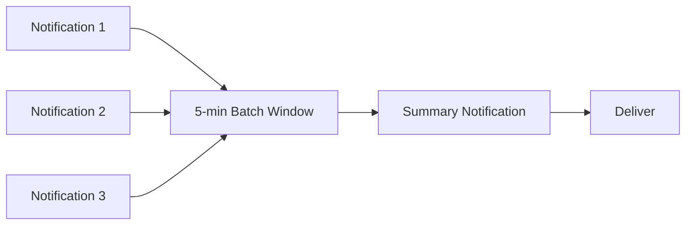

# Implementation Plan

## Phase 1: Core Pipeline (Week 1-2)

### Message Queue Setup

Set up Redis-based message queue with priority lanes:

```
Queue Structure:
  notifications:critical  → processed first, no batching
  notifications:high      → processed second
  notifications:medium    → may be held for batching
  notifications:low       → digest eligible, lowest priority
```

### Components

- [ ] Notification router (dispatches to channels based on preferences)
- [ ] Template engine with variable validation
- [ ] Email channel via SendGrid API
- [ ] In-app channel via WebSocket (reuse existing hub)
- [ ] Delivery tracking and status persistence

### Data Model

- [ ] Create `notifications` table
- [ ] Create `notification_deliveries` table (per-channel tracking)
- [ ] Create `notification_templates` table
- [ ] Create `user_notification_preferences` table

## Phase 2: Advanced Channels (Week 3)

- [ ] Push notifications via Firebase Cloud Messaging
- [ ] Push notifications via Apple Push Notification Service
- [ ] SMS channel via Twilio
- [ ] Device token registration API
- [ ] Quiet hours enforcement

## Phase 3: Batching & Digests (Week 4)

### Batch Aggregation



- [ ] Implement 5-minute batch window for social notifications
- [ ] Build daily/weekly digest aggregation
- [ ] Respect user timezone and preferred delivery time
- [ ] Digest template with notification grouping

## Verification Plan

### Unit Tests

- Template rendering with various data shapes
- Preference resolution logic (quiet hours, channel selection)
- Batch window aggregation
- Priority routing

### Integration Tests

- End-to-end notification delivery per channel
- Preference changes mid-batch
- Quiet hours with timezone edge cases
- Template variable validation errors

### Performance Tests

- 10,000 notifications/minute throughput
- WebSocket broadcast to 1,000 concurrent users
- Queue depth under sustained load
