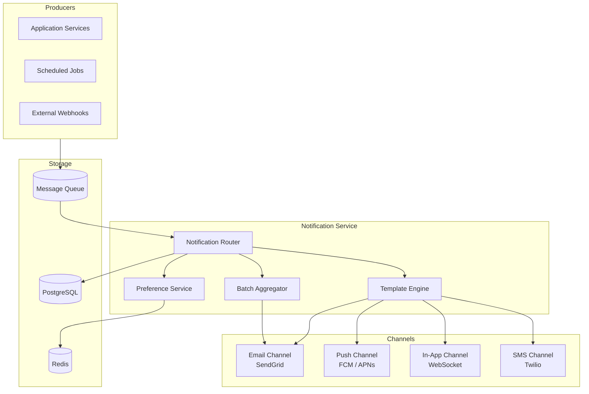
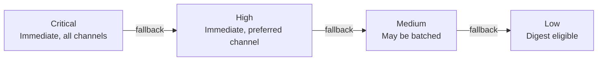
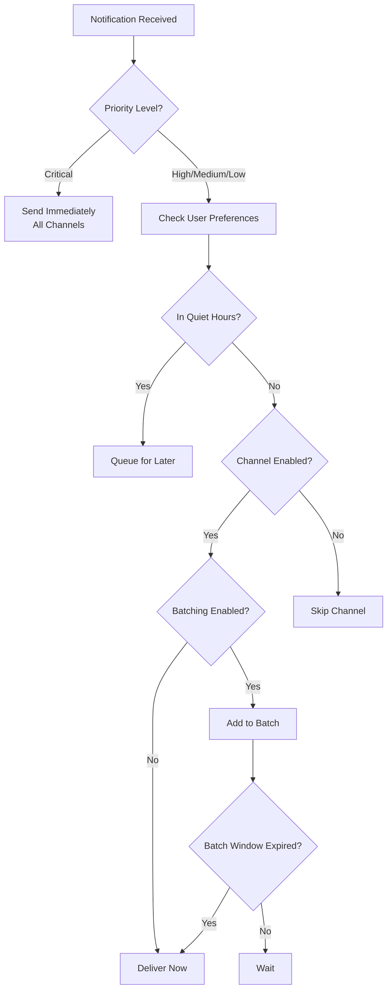

# Notification System

## Overview

A multi-channel notification system that delivers messages to users via email, push notifications, in-app alerts, and SMS. It supports templating, user preferences, batching, and delivery tracking.

## Architecture



## Notification Types

### Categories

| Category | Channels | Batching | Priority |
|----------|----------|----------|----------|
| **Security** | Email, SMS, Push | None (immediate) | Critical |
| **Transactional** | Email, In-App | None (immediate) | High |
| **Social** | Push, In-App | 5-minute window | Medium |
| **Marketing** | Email | Daily digest | Low |
| **System** | In-App | None (immediate) | Medium |

### Priority Levels



- **Critical:** Security alerts, password resets. Bypass user preferences. Delivered within 30 seconds.
- **High:** Payment confirmations, order updates. Respect channel preferences. Delivered within 1 minute.
- **Medium:** Comments, mentions, likes. May be batched into a summary. Delivered within 5 minutes.
- **Low:** Marketing, newsletters. Eligible for daily/weekly digest. Delivered at preferred time.

## Template System

### Template Definition

Templates use Go's `text/template` syntax with custom functions:

```
Subject: {{.user.display_name}}, your order #{{.order.id}} has shipped!

Hi {{.user.display_name}},

Your order containing {{len .order.items}} item(s) has been shipped.

**Tracking Number:** {{.shipment.tracking_number}}
**Carrier:** {{.shipment.carrier}}
**Estimated Delivery:** {{formatDate .shipment.eta "January 2, 2006"}}

{{if gt (len .order.items) 3}}
Here are a few items from your order:
{{range slice .order.items 0 3}}
- {{.name}} (x{{.quantity}})
{{end}}
...and {{subtract (len .order.items) 3}} more item(s)
{{else}}
{{range .order.items}}
- {{.name}} (x{{.quantity}})
{{end}}
{{end}}

Track your package: {{.shipment.tracking_url}}
```

### Template Variables

Each notification type defines its required variables:

```json
{
  "template_id": "order_shipped",
  "required_vars": ["user", "order", "shipment"],
  "channels": ["email", "push", "in_app"],
  "schema": {
    "user": {
      "display_name": "string",
      "email": "string"
    },
    "order": {
      "id": "string",
      "items": "array<{name: string, quantity: int}>"
    },
    "shipment": {
      "tracking_number": "string",
      "carrier": "string",
      "eta": "datetime",
      "tracking_url": "string"
    }
  }
}
```

## User Preferences

### Preference Model

Users can configure notification preferences per category and channel:

```json
{
  "user_id": "user_abc123",
  "preferences": {
    "security": {
      "email": true,
      "push": true,
      "sms": true,
      "in_app": true
    },
    "transactional": {
      "email": true,
      "push": true,
      "sms": false,
      "in_app": true
    },
    "social": {
      "email": false,
      "push": true,
      "sms": false,
      "in_app": true,
      "batch": true
    },
    "marketing": {
      "email": true,
      "push": false,
      "sms": false,
      "in_app": false,
      "digest": "weekly",
      "preferred_time": "09:00",
      "timezone": "America/New_York"
    }
  },
  "quiet_hours": {
    "enabled": true,
    "start": "22:00",
    "end": "08:00",
    "timezone": "America/New_York",
    "override_critical": true
  }
}
```

### Preference Resolution



## Delivery Tracking

### Status Flow

Every notification delivery is tracked per channel:

| Status | Description |
|--------|-------------|
| `queued` | In processing queue |
| `sent` | Handed off to delivery provider |
| `delivered` | Confirmed delivery (email opened, push received) |
| `failed` | Delivery failed after retries |
| `bounced` | Email bounced (hard/soft) |
| `clicked` | User clicked a link in the notification |
| `dismissed` | User dismissed the notification |

### Analytics Events

```json
{
  "notification_id": "notif_abc123",
  "user_id": "user_xyz",
  "template_id": "order_shipped",
  "channel": "email",
  "events": [
    {"type": "queued", "at": "2025-02-01T10:00:00Z"},
    {"type": "sent", "at": "2025-02-01T10:00:01Z"},
    {"type": "delivered", "at": "2025-02-01T10:00:03Z"},
    {"type": "clicked", "at": "2025-02-01T10:15:22Z", "metadata": {"link": "tracking_url"}}
  ]
}
```

## API Endpoints

### `POST /notifications`

Send a notification.

```json
{
  "user_id": "user_abc123",
  "template_id": "order_shipped",
  "category": "transactional",
  "priority": "high",
  "data": {
    "user": {"display_name": "Jane", "email": "jane@example.com"},
    "order": {"id": "ORD-456", "items": [{"name": "Widget", "quantity": 2}]},
    "shipment": {
      "tracking_number": "1Z999AA10123456784",
      "carrier": "UPS",
      "eta": "2025-02-05T18:00:00Z",
      "tracking_url": "https://track.example.com/1Z999AA10123456784"
    }
  }
}
```

### `GET /notifications/:user_id`

List a user's notifications (for in-app notification center).

### `PUT /notifications/:user_id/preferences`

Update notification preferences.

### `POST /notifications/:id/read`

Mark a notification as read.

## Non-Functional Requirements

- **Throughput:** 10,000 notifications/minute peak
- **Latency:** Critical notifications delivered < 30s, high < 1min
- **Reliability:** At-least-once delivery guarantee
- **Storage:** 90-day retention for delivery logs, 1-year for analytics
- **Compliance:** CAN-SPAM (unsubscribe in all marketing), GDPR (preference management)
